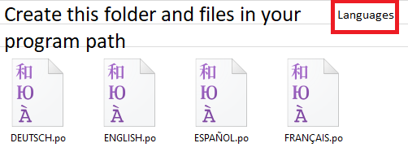

# JEasyTranslateLib

## Small library to display a combobox with the languages indicated for your program. Also translates translation files with .po extension

~~~java

	JComboBoxLanguage languagePanel = new JComboBoxLanguage(null, null);

	languagePanel.addItemListener(new ItemListener() {

		@Override

		public void itemStateChanged(ItemEvent e) {

			/*
			
				Create a folder called "Languages" 
			
				in the root of your program 
			
				and put the files with the .po extension inside

				In the translation file you have this syntax

				#: fmain.draganddrop
				msgid "Drag And Drop Here"
				msgid ""
	
				We call the method with the word that comes after "#: fmain."

				and translates it into the language chosen in the combo box
			
			*/

			System.out.println(languagePanel.translate("draganddrop"));

		}

	});
	
~~~